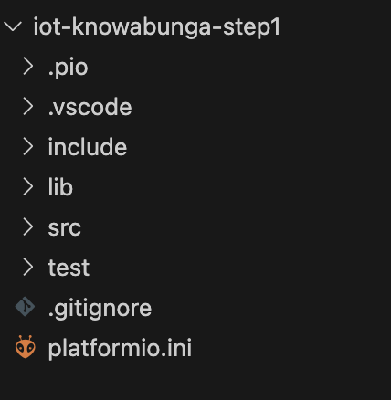

# Init
## Setting up the project
1. Open Visual Studio Code and the PlatformIO extension.
2. Create a new project, give it a name and select the `Expressif ESP32 Dev Module`. Pick `Arduino` as the framework. Specify a location or use the default one.

This will generate a project with the following file structure:



The `platformio.ini` file contains the project specific configuration file where you can configure build and upload options and list your depencies.
The `/src/main.cpp` is the entry point of the code that will be running on your ESP32.

3. Now that your project is created the PlatformIO menu should look different. If you haven't done it already plug in your ESP32 and click "upload". If the upload fails try changing the target port by opening the command palette `View -> Command Palette` (⌘ + ⇧ + p on mac) and type `PlatformIO: Set Project Port`.

## Serial communication
Now it's time to write some code.
1. Open your `src/main.cpp` file and edit it to look something like this:
```cpp
#include <Arduino.h>

void setup() {
  Serial.begin(115200);
}

void loop() {
  Serial.println("Hello?");
  
  delay(2000);
}
```
2. Open your `platformio.ini` file and add the line `monitor_speed = 115200`. This will configure PlatformIO to use the baud rate `115200` when communicating over the serial port.
3. Smash that `Upload and Monitor` button. As soon as the upload is finished it should start to listen to the serial port and print the messages sent by the ESP32. If the serial monitor doesn't open automatically click `Monitor` in the PlatformIO menu.


You should now be ready to move on to [part 2](2.hardware-interfacing.md)

