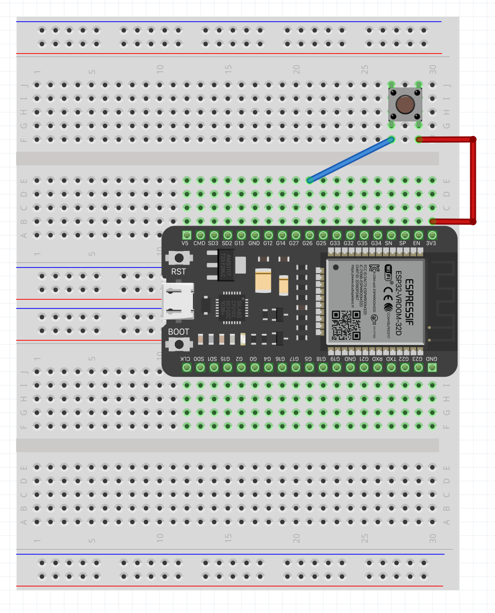
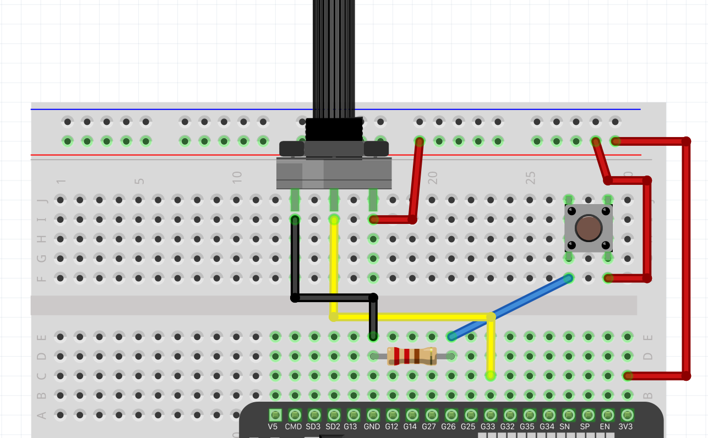

# Hardware interfacing
Watching the serial port echo "Hello?" can get quite tedious after a couple of hours. Let's wire some hardware!

## Digital read
1. Start by plugging your ESP32 into two breadboards carefully to avoid bending any pins. Reference the image below for a suggested layout.
2. Connect a button between 3.3v and the GPIO pin labeled `26`.
3. Open your `src/main.cpp` file.
4. Above `void setup()` add the line `#define BUTTON_PIN 21`. This creates a constant that doesn't take up any memory. The compiler will instead replace all occurances in the code with the given value.
5. In order to read the state of a specific pin we must define it as an input pin. Let's do so by adding `pinMode(BUTTON_PIN, INPUT);` somewhere in `setup()`.
6. To read the value of the pin you can use the built in function `digitalRead()`. Add the line `int buttonState = digitalRead(BUTTON_PIN);` somewhere in `loop()`. This function measures the voltage on the specified pin and return either `0` for 0V (LOW) and `1` (HIGH) for >0V. NEVER feed more than 3.3V to the GPIO pins of the ESP32, doing so might fry the processor.
7. Let's print the button state to the serial port. Add `Serial.println();`

Your code should now look something like this:
```cpp
#include <Arduino.h>

#define BUTTON_PIN 26

void setup() {
  Serial.begin(115200);

  pinMode(BUTTON_PIN, INPUT);
}

void loop() {
  int buttonState = digitalRead(BUTTON_PIN);
  
  Serial.println(buttonState);
}
```
You wiring should look something like this:



8. Upload the code and start the serial monitor.

You might notice that when you press the button you get a steady stream of `1` but once you let it go you get a mix of `1` and `0`, wtf?

The reason this happens is because when the button is not pushed the gpio pin receives no current and is in a floating state. To force the pin into a low state when no current is applied we will use a pull-down resistor.

9. Connect a 10k ohm resistor between the gpio pin `26` and `gnd`. This will pull the voltage down to 0 on the gpio pin when the button is not pressed.
10. Verify in the serial monitor that the state is stabilized. A steady stream of `0` should now be printed when the button is not pressed.


## Analog read
Some of the gpio pins on the ESP32 are also capable of reading analog values. Instead of just returning a `1` or `0` the analog read measures the voltage between 0 and 3.3v on the gpio pin and returns a value between 0 and 4095.
To illustrate this we will wire a potentiometer to the ESP32. A potentiometer is basically just a variable resistor with three pins: Vin, Output and Ground.

1. Open your `src/main.cpp` file.
2. Below `#define BUTTON_PIN 26` add `#define POTENTIOMETER_PIN 33`
3. Add a potentiometer to your breadboard and wire it like on the image below:



4. Somewhere in `void loop()` add the line `int potentiometerValue = analogRead(POT_PIN);` and print the new value to the serial port.

You should now be able to turn the dial on the potentiometer and see the value in the serial port change.

5. The Arduino library contains a handy function called `map()`. It basically takes an input and re-maps the value from one range to another. 
Let's try to map the potentiometer value to a 0 to 10 range by adding `int mappedValue = map(potentiometerValue, 0, 4095, 0, 10);`.
6. Upload, open the serial monitor and strap in for the ride of your life.

The full code:

```cpp
#include <Arduino.h>

#define BUTTON_PIN 26
#define POTENTIOMETER_PIN 33

void setup() {
  Serial.begin(115200);

  pinMode(BUTTON_PIN, INPUT);
}

void loop() {
  int buttonState = digitalRead(BUTTON_PIN);
  int potentiometerValue = analogRead(POT_PIN);
  int mappedValue = map(potentiometerValue, 0, 4095, 0, 10);

  Serial.println(mappedValue);
}
```
<br/>

If you are tired of watching a crappy offbrand version of the Matrix in your serial monitor you can proceed to the [next part](3.ux.md)