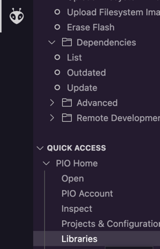
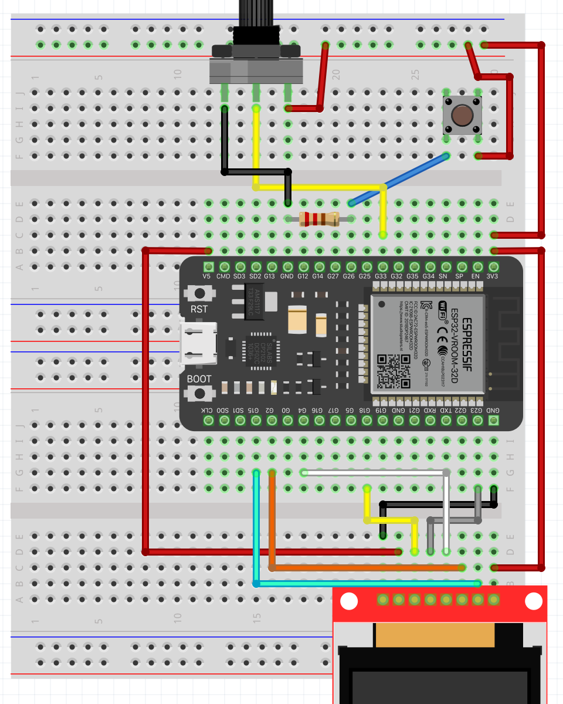

# User experience
It's time to wire up and add support for displaying useless information on the TFT display.

Fortunately enough someone else had this idea before and decided to write a library to make it easier to interface with the display. Let's add it to our project.

1. Go to platform.io tab and under `PIO Home` click libraries.



2. Search for the library called `TFT_eSPI` and add it to your project.

Next you will be doing some configuring to use the right drivers for the screen. 

3. Go to, in your project, `.pio/libdeps/[your board]/TFT_eSPI/User_Setup.h`

4. Uncomment the line `#define ST7735_DRIVER` so that driver is used. Comment out the already defined driver.
5. Uncomment lines 207-211 so that it looks like this:
 ```cpp
#define TFT_MOSI 23
#define TFT_SCLK 18
#define TFT_CS   15  // Chip select control pin
#define TFT_DC    2  // Data Command control pin
#define TFT_RST   4  // Reset pin (could connect to RST pin)
```

Now it's time to carefully wire the display to your ESP32.
TFT pins    |   ESP32 pins
------------|--------------
GND         |   GND
VCC         |   5V
SCK         |   18
SDA         |   23
RES         |   4
RS          |   2
CS          |   15
LEDA        |   3.3V



Now it's time to add the code needed to make the display come to life.

6. Open your `src/main.cpp` file and at the top add `#include <TFT_eSPI.h>` to import the library.
7. Somewhere where you have defined the button and potentiometer pins add the line `TFT_eSPI tft = TFT_eSPI();`. This will create a global variable (some people just want to watch the world burn) with an instance of the tft library.
8. Add the following lines somewhere in `setup()`
```cpp
tft.init();
tft.setRotation(1);
``` 
9. Add the following function above your `loop()`
```cpp
void printStuff() {
  tft.fillScreen(TFT_BLACK);
  tft.setCursor(0, 0, 2);
  tft.setTextColor(TFT_RED,TFT_BLACK);    
  tft.setTextFont(2);
  tft.println("IoT Knowabunga 2023");
}
```
10. Call it from somewhere in `loop()`
11. Put on your lucky socks and upload the code. If all the stars are aligned you should see the text `IoT Knowabunga 2023` on your display. If you see that the colors are reversed on your screen, you can uncomment line 76 `#define TFT_RGB_ORDER TFT_RGB` in `.pio/libdeps/[your board]/TFT_eSPI/User_Setup.h`.

You might notice that the display is flickering, that it because you can actually see each re-rendering for every iteration of the main loop.
We are currently wasting cpu cycles re-rendering the same text over and over again. Let's fix that!

12. Let's define a global variable to store the previously rendered text. That's easy - just define a string somewhere, compare its value to the new value and Bob's your uncle, right?

Unfortunately, it's a bit more complicated than that in the world of Arduino. There is a built-in String type but that is known to allocate a lot of memory and cause memory fragmentation if used without caution. In this tutorial we will instead use character arrays.

Add `char previousDisplayValue[100];` somewhere in the top before `setup()`.

13. Change the `printStuff()` function to this:
```cpp
void printStuff(char* someText) {
  tft.fillScreen(TFT_BLACK);
  tft.setCursor(0, 0, 2);
  tft.setTextColor(TFT_RED,TFT_BLACK);    
  tft.setTextFont(2);
  tft.println(someText);

  strcpy(previousDisplayValue, someText);
}
```

`strcpy()` is a built-in function for copying the content of a char array to another.

14. In `loop()` remove the `printStuff()` line and replace it with:
```cpp
char msg[] = "IoT Knowabunga 2023";

printStuff(msg);
```

15. If you upload the code the display should still display "IoT Knowabunga 2023" and flicker. Try using the built in character array comparison function `strcmp` to stop the flicering.

```cpp
void printStuff(char* someText) {
  if (strcmp(previousDisplayValue, someText) == 0) {
    return;
  }

  tft.fillScreen(TFT_BLACK);
  tft.setCursor(0, 0, 2);
  tft.setTextColor(TFT_RED,TFT_BLACK);    
  tft.setTextFont(2);
  tft.println(someText);

  strcpy(previousDisplayValue, someText);
}
```

You should hopefully have a non-flickering display now.

16. Instead of just displaying the same static text let's display the potentiometer value on the screen instead. To do so we need to convert the integer `mappedValue` to a character array and pass it to `printStuff`. To do this replace `char msg[] = "IoT Knowabunga 2023";` with the following lines: 
```cpp
char msg[4];
itoa(mappedValue, msg, 10);
```

17. Remove the `Serial.println(mappedValue);` from `loop()`. We don't need to print that value to the serial port now that we see it on the display.

Your code should now look something like this:
```cpp
#include <Arduino.h>
#include <TFT_eSPI.h>

#define BUTTON_PIN 26
#define POTENTIOMETER_PIN 33

TFT_eSPI tft = TFT_eSPI();
char previousDisplayValue[100];

void setup() {
  Serial.begin(115200);

  pinMode(BUTTON_PIN, INPUT);
  tft.init();
  tft.setRotation(1);
}

void printStuff(char* someText) {
  if (strcmp(previousDisplayValue, someText) == 0) {
    return;
  }

  tft.fillScreen(TFT_BLACK);
  tft.setCursor(0, 0, 2);
  tft.setTextColor(TFT_RED,TFT_BLACK);    
  tft.setTextFont(2);
  tft.println(someText);

  strcpy(previousDisplayValue, someText);
}

void loop() {
  int buttonState = digitalRead(BUTTON_PIN);
  int potentiometerValue = analogRead(POTENTIOMETER_PIN);
  int mappedValue = map(potentiometerValue, 0, 4095, 0, 10);

  char msg[4];
  itoa(mappedValue, msg, 10);

  printStuff(msg);
}
```
Upload the code. If you turn the dial of the potentiometer the displayed value should now change. Proceed to the [next part](4.wifi-and-mqtt.md) of the tutorial.

### Extras

Try displaying some images or animations. 
Look in `.pio/libdeps/[your board]/TFT_eSPI/examples`

A useful tool for converting images to bitmaps: https://javl.github.io/image2cpp/
